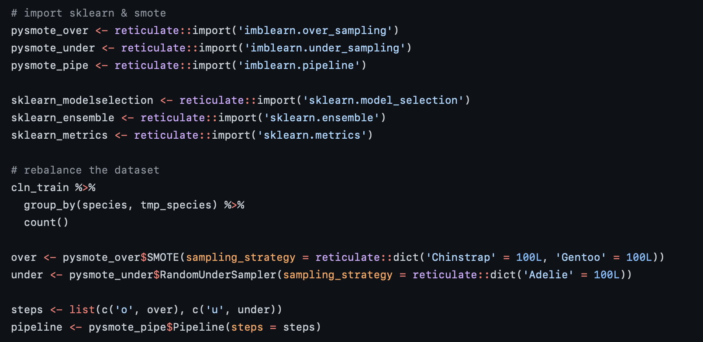

```{r setup, include=FALSE}
options(htmltools.dir.version = FALSE)
knitr::opts_chunk$set(
  fig.width=9, fig.height=3.5, fig.retina=3,
  out.width = "100%",
  cache = FALSE,
  echo = TRUE,
  message = FALSE, 
  warning = FALSE,
  hiline = TRUE
)

library(fontawesome)
```

```{r xaringan-themer, include=FALSE, warning=FALSE}
library(xaringanthemer)
style_xaringan(
  background_color = '#000000',
  text_color = '#FFFFFF',
  text_font_family = 'Montserrat Alternates',
  header_color = '#FFFFFF',
  header_font_family = "Source Sans Pro",
  code_font_family = "IBM Plex Mono",
  code_inline_color = "#ffa600",
  code_font_size = "0.6em",
  text_slide_number_color = "#b6bfc2",
  extra_fonts = list(
    google_font(family = "Source Sans Pro"),
    google_font(family = "Signika"),
    google_font(family = "Montserrat Alternates"),
    google_font(family = "IBM Plex Mono"),
    google_font(family = "Lemonada")
  ),
  extra_css = list(
    ".fancy" = list("font-family" = "Signika"),
    ".large" = list("font-family" = "Source Sans Pro"),
    "img.circle" = list('border-radius' = '50%'),
    "h3" = list("font-family" = 'Source Sans Pro'),
    "img.center" = list("margin-left" = "auto", "margin-right" = "auto"),
    ".remark-slide-number" = list('opacity' = 0L)
  )
)
```


# The Dilemma

### `r fa(name = 'glass-cheers', fill = 'steelblue')` R vs. Python

### `r fa(name = 'server', fill = 'steelblue')` Deployment in one language

### `r fa(name = 'book', fill = 'steelblue')` Some libraries easier to use

---

# Enter Reticulate

### `r fa(name = 'r-project', fill = 'steelblue')` R library; developed by RStudio

### `r fa(name = 'python', fill = 'steelblue')` Leverage Python libraries within R

### `r fa(name = 'birthday-cake', fill = 'steelblue')` Translates R & Python objects on the fly

---

# Benefits

### `r fa(name = 'book-open', fill = 'steelblue')` Use any library from either language

### `r fa(name = 'project-diagram', fill = 'steelblue')` Maintain workflow when using R

---

# Typical Workflow

### `r fa(name = 'r-project', fill = 'steelblue')` Data Analysis

### `r fa(name = 'r-project', fill = 'steelblue')`,`r fa(name = 'python', fill = 'steelblue')` Data Modeling

### `r fa(name = 'docker', fill = 'steelblue')` Deployment

---

# Example



---

# Python Users [R]ejoice!

**rpy2**

- Python library (similar to reticulate)
- enables execution of R code

---

# Resources

Sample R code with Reticulate

- https://github.com/nikdata/2021_DSM-Data-Analytics-March-Presentation/blob/main/reticulate.Rmd

RPy2

- https://rpy2.github.io/index.html

Presentation

- <LINK HERE>